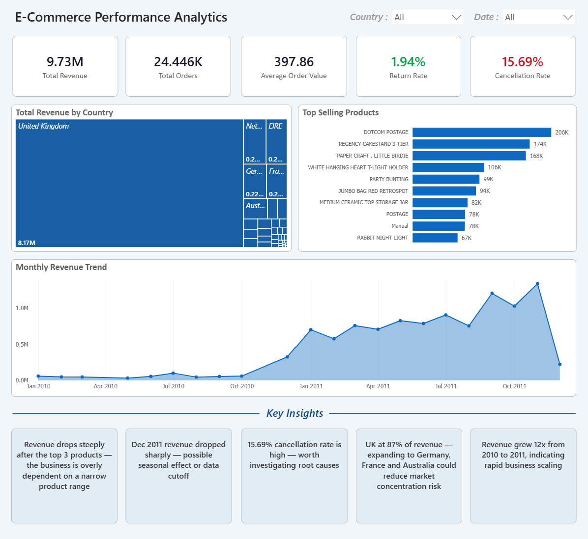

# Business Sales Performance Analytics

## Task Objective
Built as part of a data analytics internship task — analysing 
e-commerce sales data to answer key business questions and 
deliver actionable insights as if advising a real business.

## Tools Used
- Ms Excel
- Power BI Desktop
- DAX (Data Analysis Expressions)

## Dataset
📦 E-commerce Orders Dataset (Kaggle) : 
[https://www.kaggle.com/datasets/carrie1/ecommerce-data]

- Transactions from a UK-based online retailer
- Period: January 2010 to December 2011
- 500,000+ records cleaned and prepared for analysis

## Dashboard Preview
E-commerce Dashboard :

## Key Metrics
| Metric | Value |
|--------|-------|
| Total Revenue | £9.73M |
| Total Orders | 24,446K |
| Average Order Value | £397.86 |
| Return Rate | 1.94% |
| Cancellation Rate | 15.69% |

## Business Questions Answered
- Which products generate the most revenue?
- How do sales change over time?
- Which regions are most profitable?
- Where should the business focus to grow faster?

## Key Insights
- Revenue grew 12x from 2010 to 2011, indicating rapid business scaling
- UK drives 87% of total revenue — significant market concentration risk
- 15.69% cancellation rate is high — worth investigating root causes
- Revenue drops steeply after top 3 products — narrow product dependency
- Dec 2011 revenue dropped sharply — possible seasonal effect or data cutoff
- Expanding to Germany, France and Australia could reduce market concentration risk

## Skills Demonstrated
- Data cleaning & preparation
- Business-focused KPI analysis
- Trend and performance analysis
- Insight generation and reporting
- Business storytelling using data
  
